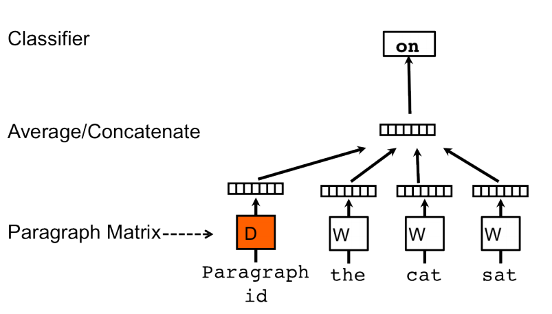
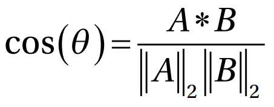

# ASRS cosine similarity analysis

### Part of [Berkeley Institute for Data Science](https://bids.berkeley.edu) research on the aviation industry

## Preprocessing
1. All string columns are lowercased (narrative, synopsis, airporttraconcode1).
2. All rows with an NA value for narrative, synposis, tracon, or date removed. 
3. All characters in the following string are dropped from narrative and synopsis.
    * ``'[!"#$&\'()*+,:;<=>?@[\\]^_`{|}~/-]\.%'``
4. Each word is lemmatized (using nltk's WordNetLemmatizer) and then stemmed (using nltk's Snowball Stemmer)
5. Dates are converted to pandas Timestamp object
6. Duplicate entries are flagged in binary 'is_dup' column.

## Getting Started
### Requirements
1. Place .csv file in `datasets/asrs/`, and each file needs to have the following columns:
   * narrative, synopsis, airporttraconcode1, date
2. If you are using conda, run `conda env create -f environment.yml`
    * Then run `conda activate weed_nlp`
    * After files created, run `conda deactivate` to exit
### Optional arguments
1. The sliding window (in months) for cosine similarity calculations can be set on line 11 of `cosine_analysis.py`. A sliding window of 6 means that entries within a 3 month range either before or after a given entry are used in the calculation—for example, an entry dated June would be compared with entries from March - September. It must be an even number, as it is symmetric about a given entry. 
2. There are a number of hyperparameters for Doc2Vec training, which can be specified on line 248 of `generate_doc2vec.py`. More details can be found below in the Doc2Vec section and at https://radimrehurek.com/gensim/models/doc2vec.html.
### Running Cosine Analysis
Run `./run_cos_sim`. If this does not work run `chmod u+x run_cos_sim` first, then run the bash file.

### Outputs 
The new dataframe will be saved in `results/all/final_cosine_df.csv`
* In total, 18 new columns are created. Each column is in the format `{d2v|tfidf|bow}_cossim_{nar|syn}{_all|}`
   * The first selection indicates what text representation is used
   * The second indicates what column is compared (narrative or synopsis)
   * The third indicates whether or not we calculate within sliding windows
* All similarity values are normalized to be between 0 and 1
* Examples
   * `d2v_cossim_syn_all`: the average cosine similarity of the doc2vec representation of a particular synopsis to that of all other synopses with the same air traffic control code
   * `tfidf_cossim_nar`: the average cosine similarity of the tfidf representation of a particular narrative compared to that of all other narratives with the same air traffic control code, within the given sliding window (e.g. within 18 months) of the narrative's date

## Doc2Vec

Doc2Vec utilizes a two-layer neural network to learn representations of words and documents/paragraphs (where a document is a collection of words separated by a space). 
* **Inputs**
   * A paragraph ID (that is one-hot encoded based off of the number of documents you're training with)
   * A list of words (that are also one-hot encoded). The length of the list of words is a hyperparameter (and it represents the length of the sliding window).
* **Middle Layer**: this middle layer is our vectorized representation of the paragraph ID, as well as each individual word.
* **Ouputs**:
   * Softmax probabilities predicting the next word.
* Example: consider the statement 'the cat sat on the hat', which is our first statement in our training set (which has 4 total sentences), and assume we are using a 3 word window (as above). Assume that the ordering of our dictionary of words is \['the', 'cat', 'sat', 'on', 'hat'\] (which means that \[1, 0, 0, 0, 0\] represents the word 'the').
   * Paragraph ID (input): \[1, 0, 0, 0\]
   * List of words (input)
      * the: \[1, 0, 0, 0, 0\]
      * cat: \[0, 1, 0, 0, 0\]
      * sat: \[0, 0, 1, 0, 0\]
   * output word: \[0, 0, 0, 1, 0\] ('on')

Doc2Vec has two phases: **training**, and **inference**
1. Training: the goal of training is to utilize the document id and the list of words to predict the next word (utilizing gradient descent)
   * The first layer therefore creates a vector representation for each word as well as each document ID.
   * Using the sliding window to predict the next word forces similar words to be placed near each other (and similar documents) within this vectorized space
2. Inference: If the doc2vec model is used to predict a document id for a new sentence, then we don't have a Paragraph ID to compute the representation. Therefore, a reverse calculation is done
   * Fixing the other weights, we perform the same calculation except the Paragraph ID is randomized, and the output word is fixed. Using gradient descent, the paragraph ID is changed to maximize the probability for the true predicted word.

## Files
Note, if you'd like the whole process to run, then simply run the bash script. However, if for any reason you'd like to dig into any of the individual python files (and run them independently), read below:

### generate_doc2vec.py
This file cleans the dataframes in `datasets/asrs`, concatenates all of them together, cleans the important columns (narrative, synopsis, etc.), and saves the dataframe with the cleaned columns in `datasets/all/cleaned_df_xx.csv` where xx is an index.
    
This will also generate the doc2vec representations of each of the string columns (narrative, synopsis) and save them as npy files (in `results/(narrative|synopsis)/d2v_{}.npy` where the first selection represents which column we've analyzed and the second is an index).

#### Running generate\_doc2vec.py by itself
No other requirements other than the ones stated above.

### tfidf.py
This file takes the cleaned files that `generate_doc2vec.py` generated, and run a tfidf model on all the narratives and synopses. Generates the representations of each and saves them as npz files (to save space)

#### Running tfidf.py by itself
* You must run `python3 generate_doc2vec.py` before you run this file
* Replace `in_path` with your own path to `cleaned_df_{}.csv` (if the cleaned files are in a different place than normal)
* Run `python3 tfidf.py`.
* Outputs are saved in `/results/{narrative|synopsis}/tfidf_{}.npz` where the first selection is which column we've analyzed and the second is an index (these are scipy sparse matrices).

### bag\_of\_words.py
This does the same as `tfidf.py` except it utilizes a bag of words model to generate the representations.

#### Running bag\_of\_words.py by itself
* You must run `python3 generate_doc2vec.py` before you run this file
* Replace `in_path` with your own path to `cleaned_df_{}.csv` (if the cleaned files are in a different place than normal)
* Run `python3 bag_of_words.py`.
* Outputs are saved in `/results/{narrative|synopsis}/bow_{}.npz` (these are scipy sparse matrices).

### cosine\_analysis.py

This utilizes the files generated by all three previous files. For each narrative/synopsis, we calculate the average cosine similarity for the vector representation (doc2vec/tfidf/bow) of that particular string to that of all other strings with the same air traffic control code and within a given time window of that entry's date. Makes new columns in the dataframe (and saves to `results/all/final_cosine_df.csv`).

#### Running cosine\_analysis.py by itself
* You must run all of the python files above, before running this file.
